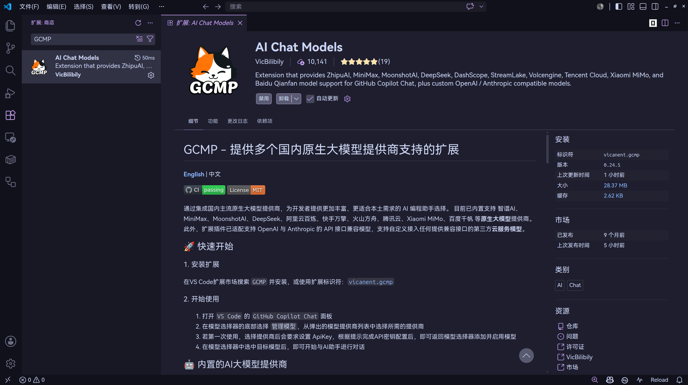
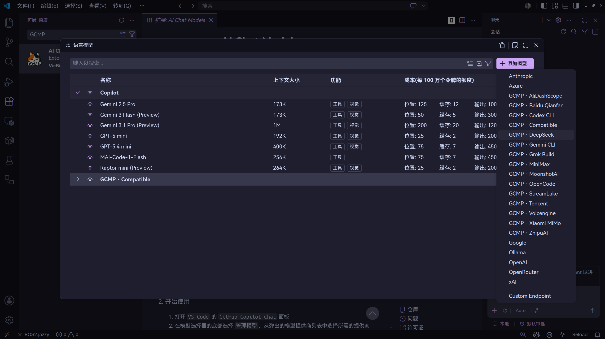

GitHub Copilot 学生套餐一改再改，现如今删除了大部分强大的模型不说，一个月还只有相当于2美元的额度，基本已经属于不可用的程度了。现在也有越来越多的独立于编辑器的编码智能体，如 Codex、OpenCode等，但是依旧可以利用插件，继续在 VSCode 里以习惯的方式使用其他供应商提供的模型（如DeepSeek）。

## GCMP 是什么

GCMP（GitHub Copilot Model Providers）是一个 VS Code 扩展，为 GitHub Copilot Chat 提供国产大模型支持。它内置了 DeepSeek、智谱 AI、MiniMax、MoonshotAI、阿里云百炼等主流国产模型，MIT 开源协议，免费使用。

- 开源仓库：[https://github.com/VicBilibily/GCMP](https://github.com/VicBilibily/GCMP)
- 扩展 ID：`vicanent.gcmp`

## 注册 DeepSeek 并获取 API Key

前往[DeepSeek 平台](https://platform.deepseek.com)注册账号，在 API Keys 页面创建密钥并充值。

## 安装 GCMP

在 VS Code 扩展市场中搜索`GCMP`​或直接输入扩展 ID `vicanent.gcmp`安装即可。

## 配置 DeepSeek 模型

安装完成后按以下步骤操作：

1. 打开 VS Code 的 **GitHub Copilot Chat** 面板
2. 点击聊天输入框下方的模型选择器
3. 在底部齿轮选择**管理语言模型**
4. 点击右上角的**添加模型**，在弹出的提供商列表中选中 **GCMP · DeepSeek**
5. 首次选择会提示输入 API Key，粘贴上一步获取的密钥
6. 返回模型选择器，勾选 **DeepSeek-V4-Flash** 或 **DeepSeek-V4-Pro** 启用

## 开始使用

在 Copilot Chat 模型选择器中选中已启用的 DeepSeek 模型，即可像使用原版 Copilot 一样进行对话。状态栏会显示当前账户余额，方便随时查看。
