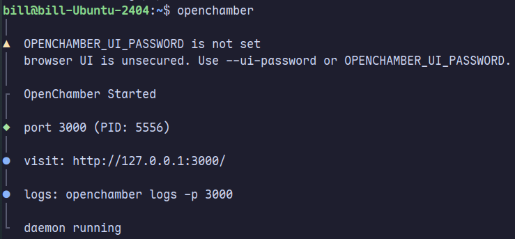
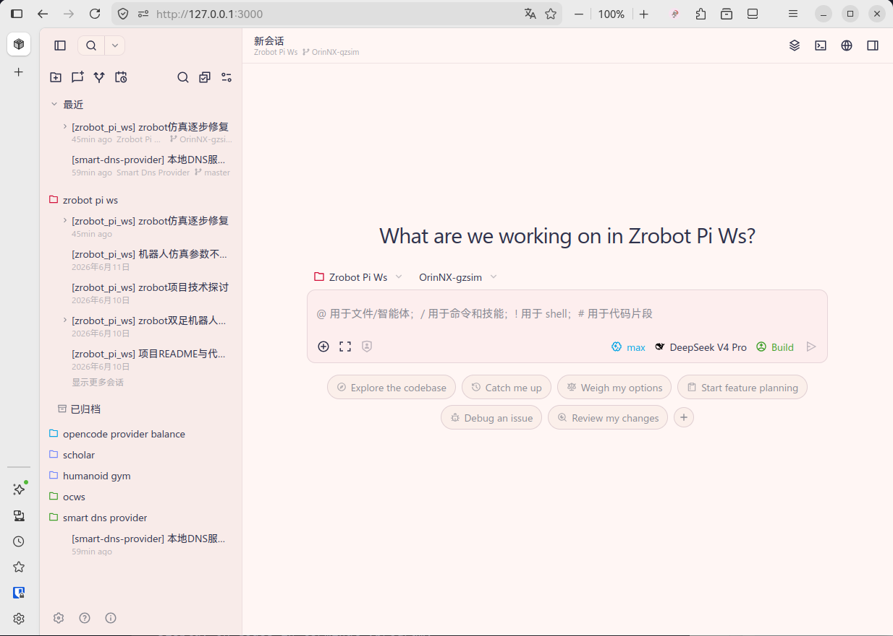

## 安装

> [!TIP]
> Windows 安装直接跳到 [Windows 安装 Node](#windows-安装-node) 即可。

### 安装脚本

对于 Linux 和 macOS 系统，可以使用安装脚本直接安装。

```bash
curl -fsSL https://opencode.ai/install | bash
```

如果网络下载速度过慢或失败，以及 Windows 用户，可以使用 NPM 安装。

### 使用 NPM 安装

首先确保安装有 Node 环境，参考[下载 Node.js](https://nodejs.org/zh-cn/download)。

#### Linux 安装 Node

对于 Ubuntu，可以使用以下命令安装：

```bash
# 下载并安装 nvm（此处使用了 gh-proxy 加速）：
curl -o- https://gh-proxy.org/https://raw.githubusercontent.com/nvm-sh/nvm/v0.40.3/install.sh | bash

\. "$HOME/.nvm/nvm.sh"

# 使用 nvm 下载并安装最新 LTS 版本的 Node.js：
nvm install --lts

# 验证 Node.js 版本：
node -v # Should print "v24.16.0".

# 验证 npm 版本：
npm -v # Should print "11.13.0".
```

#### Windows 安装 Node

对于 Windows，在[下载 Node.js](https://nodejs.org/zh-cn/download)页面下方找到“或者获得适用于 Windows x64 平台的 Node.js 构建”，点击下载 Windows 安装程序 (.msi) 安装即可。

#### 安装 OpenCode

Node.js 安装完成后（自带 npm），在终端中执行：

```bash
npm install -g opencode-ai
```

安装完成后，在任意终端输入 `opencode` 命令即可启动 TUI 界面的 OpenCode，同时会将当前所在文件夹作为工作目录。

### 添加供应商

启动 OpenCode 后，按下 `Ctrl+P` 可以打开命令菜单，在其中找到 **Connect provider**，输入供应商名称（如 DeepSeek）即可搜索，选中后输入对应的 API Key 即可。

OpenCode 官方也提供了名为 OpenCode Zen 和 OpenCode Go 的大模型服务，并提供部分免费额度，可参考[OpenCode Zen 定价](https://opencode.ai/docs/zh-cn/zen/#%E5%AE%9A%E4%BB%B7)。注册账号后将 API Key 添加到 OpenCode 中即可使用。

## 桌面应用

OpenCode 官方提供了桌面应用，但目前功能较少，不推荐使用。推荐使用第三方的 [OpenChamber](https://openchamber.dev/zh/)。

对于 macOS 和 Windows，可以直接下载其桌面应用。

对于 Linux，则需要安装 NPM 包后，在浏览器中以网页形式使用。

首先使用 NPM 安装 OpenChamber：

```bash
npm i -g @openchamber/web
```

安装完成后，在终端中运行 `openchamber`，随后打开其输出的地址（通常为 `http://127.0.0.1:3000/`）即可进入 OpenChamber 的主界面。



进入主界面后，可以在设置中将语言切换为中文。


